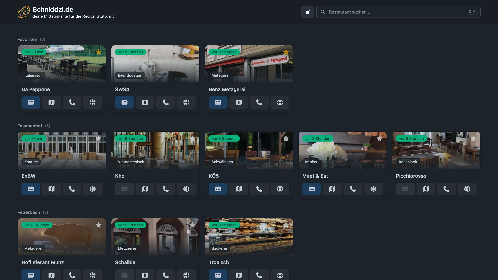
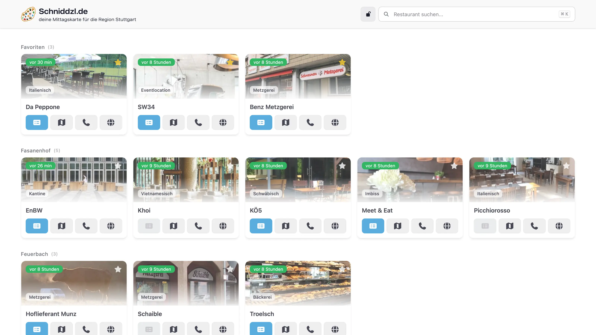

# Mittagskarte

Mittagskarte fetches, uploads, converts, and serves lunch menus for restaurants.

The current stack is:

- Go backend with PocketBase
- Vue 3 frontend built with Vite
- PocketBase collections and migrations for restaurant data
- Playwright, MuPDF, and ImageMagick for scraping and file conversion

## Screenshots

<p align="center">
  
  
</p>

## Architecture

The app is split into two parts during development:

- `backend/`: PocketBase app, custom API routes, migrations, scraping pipeline
- `frontend/`: Vue application

In production, the Vue app is built to `dist` and served directly by the Go/PocketBase server.

Routes:

- `/`: Vue app entrypoint (`index.html`)
- `/assets/*`: built frontend assets from Vite
- `/static/*`: static frontend assets
- `/_`: PocketBase dashboard and internal UI
- `/api/*`: PocketBase API plus custom backend endpoints
- `/health`: simple health endpoint returning `.`

## PocketBase Data Model

The application schema is managed through PocketBase migrations in `backend/migrations`.

Current app collections:

- `restaurants`
- `selectors`
- `menus`

All three collections are publicly listable and viewable.

Collection relationships:

- each restaurant can reference multiple `selectors` via `navigate`
- each menu belongs to exactly one restaurant (`menus.restaurant`)
- each restaurant stores a rolling list of latest menu ids in `restaurants.menus`

Menu retention is limited by the backend setting `MAX_AMOUNT_OF_MENUS` (default: `10`).

The backend also uses PocketBase auth for protected operations.

Protected custom endpoints:

- `POST /api/restaurants/scrape`

## How It Works

Restaurant menus can be obtained in three ways:

- scrape content from websites
- download files directly
- upload files manually

Files are normalized by the backend and stored in PocketBase-managed records. The app supports PDF and image sources and generates browser-friendly menu images for the frontend.

For each menu create event, the backend:

- converts input files to optimized `webp`
- stores calculated dimensions (`width`, `height`, `landscape`)
- computes a content hash and rejects unchanged uploads/scrapes
- prepends the new menu id to the restaurant `menus` relation
- removes older menu records beyond `MAX_AMOUNT_OF_MENUS`

## Selectors and Examples

In the PocketBase model, each restaurant can reference multiple selector records through the relation field `navigate`.

Each selector record contains:

- `locator`: CSS selector or XPath
- `attribute`: optional attribute to read (for example `src` or `href`)
- `style`: optional CSS injected before interaction, useful to hide overlays or cookie banners

Typical usage pattern:

- First selector steps are used for navigation (clicks)
- Last selector step is used for extraction or screenshot logic

Example selector list:

```yaml
navigate:
	- locator: ".cookie-accept-btn"
		attribute: ""
		style: ""
	- locator: "a.mittag-link"
		attribute: "href"
		style: ""
```

### Example 1: Direct Download (method = download)

Use `method = download` and set the first selector locator to the direct file URL.

```yaml
restaurant:
	method: "download"
	content_type: "pdf"
	navigate:
		- locator: "https://example.com/mittagskarte.pdf"
			attribute: ""
			style: ""
```

### Example 2: Image Download via Attribute (method = scrape)

Set `attribute` on the last selector to read an image or link source.

```yaml
restaurant:
	method: "scrape"
	content_type: "image"
	navigate:
		- locator: ".menu-image img"
			attribute: "src"
			style: ""
```

### Example 3: PDF Link via XPath (method = scrape)

XPath works as locator input as well.

```yaml
restaurant:
	method: "scrape"
	content_type: "pdf"
	navigate:
		- locator: "//a[contains(text(), 'Mittagstisch')]"
			attribute: "href"
			style: ""
```

### Example 4: HTML Screenshot with Injected Style (method = scrape)

For HTML content, the scraper can screenshot the selected element. Optional style can hide fixed headers or navigation.

```yaml
restaurant:
	method: "scrape"
	content_type: "html"
	navigate:
		- locator: "p.paragraph-mittagstisch-right-corona"
			attribute: ""
			style: ".w-nav { display: none !important; }"
```

### Dynamic Date Placeholders in Locators

You can use date placeholders in selector locators:

```yaml
locator: "//div[@class='calendar']//span[text()='{{date(format=02.01.2006, day=fr, offset=-1)}}']"
```

Supported arguments:

- `format`: Go date format, for example `02.01.2006`
- `lang`: language, for example `en` or `de`
- `day`: target weekday, for example `monday` or `fr`
- `offset`: week offset, for example `-1`, `0`, `1`
- `upper`: uppercase output toggle

## Deployment

The production image is built from the repository root through the `release` service in `compose.yml` and includes:

- the compiled Go/PocketBase binary
- the built Vue `dist` output
- runtime dependencies required for Playwright, MuPDF, and ImageMagick

Build the release image locally:

```sh
docker compose --profile build build release
```

This produces the local image `mittagskarte:local` by default.
The GitHub release workflow uses Docker Bake against the same `release` target, so local and CI builds stay aligned.

Run it:

```sh
docker run --rm -p 8090:8090 mittagskarte:local
```

Then open http://localhost:8090.

Important runtime paths:

- PocketBase data directory: `data/pb`
- frontend bundle served by backend: `dist`
- temporary download/processing files: `/tmp/downloads` (ephemeral in container lifecycle)

## Development

Local development uses Docker Compose with separate backend and frontend containers.

Start the stack:

```sh
docker compose up --build --force-recreate
```

Development URLs:

- frontend: `http://localhost:5173`
- backend: `http://localhost:8090`
- PocketBase dashboard: `http://localhost:8090/_/`

Compose services:

- `backend`: PocketBase backend with hot reload via `air`
- `frontend`: Vite dev server
- `go`: helper container for Go commands
- `yarn`: helper container for frontend package commands
- `release`: build-only production image target used by local release builds and CI

## Common Commands

Install or update frontend dependencies:

```sh
docker compose run --rm yarn install --frozen-lockfile
docker compose run --rm yarn upgrade --latest
```

Update Go modules:

```sh
docker compose run --rm go get -u ./...
docker compose run --rm go mod tidy
```

Build the frontend manually:

```sh
cd frontend
yarn build
```

## Notes

- The backend expects a built frontend bundle in `dist` when serving the production app.
- Release builds are driven from `compose.yml`, and CI reuses the same `release` target.
- The repository currently targets `linux/amd64` for Docker builds because of native library dependencies used by `go-fitz` and ImageMagick.
